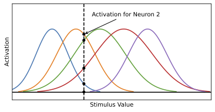
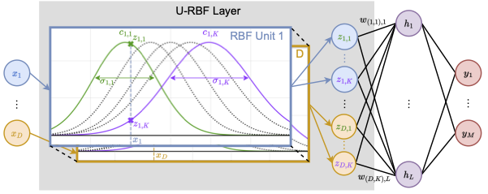
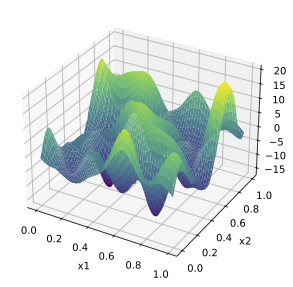
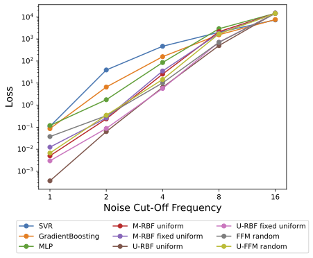
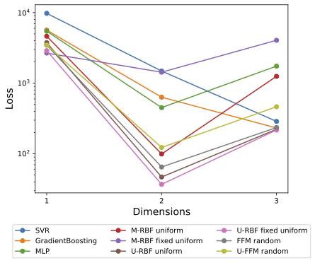
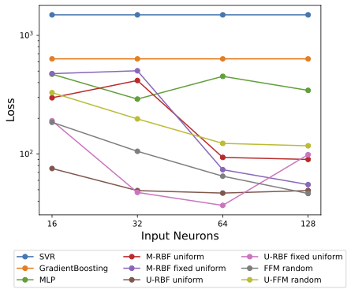
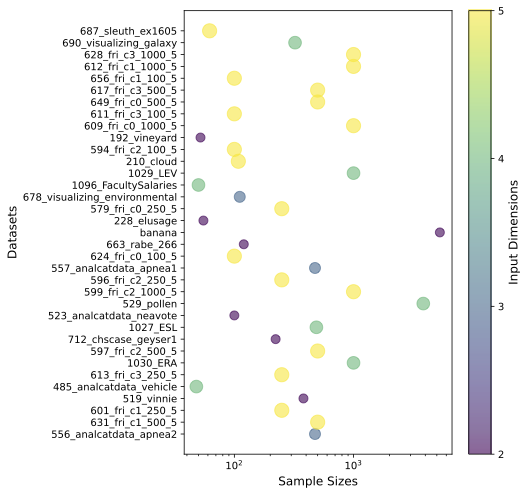
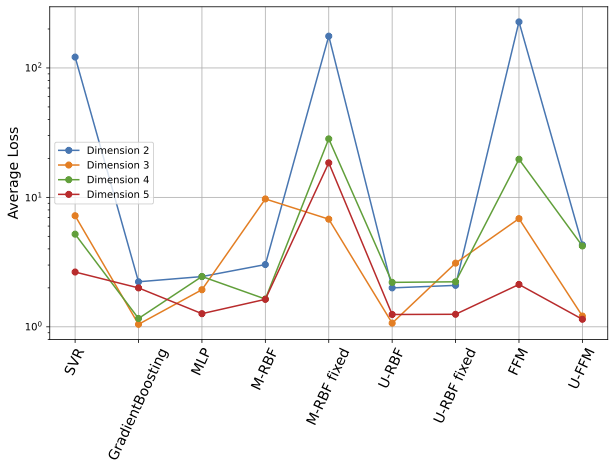

# Univariate Radial Basis Function Layers
## Brain-inspired Deep Neural Layers for Low-Dimensional Inputs

**Daniel Jost, Basavasagar Patil, Chris Reinke, Xavier Alameda-Pineda**

February 2024

[[Paper](https://arxiv.org/abs/2311.16148)] &emsp;&emsp; [[Code](https://gitlab.inria.fr/robotlearn/urbf)]

Deep Neural Networks (DNNs) became the standard tool for function approximation with most of the introduced architectures being developed for high-dimensional input data. However, many real-world problems have low-dimensional inputs for which the standard Multi-Layer Perceptron (MLP) are a common choice. An investigation into specialized architectures is missing. We propose a novel DNN input layer called Univariate Radial Basis Function (U-RBF) Layer as an alternative. Similar to sensory neurons in the brain, the U-RBF Layer processes each individual input dimension with a population of neurons whose activations depend on different preferred input values. We verify its effectiveness compared to MLPs and other state-of-the-art methods in low-dimensional function regression tasks. The results show that the U-RBF Layer is especially advantageous when the target function is low-dimensional and high-frequent.
____
### Low Dimensional Inputs
Existing deep learning approaches were mainly developed for high-dimensional inputs such as Convolutional Neural Networks (CNNs) for images. However, many real-world problems have low-dimensional inputs for which the standard MLP are a common choice. As an example, the Penn Machine Learning Benchmarks (PMLB) ([Romano et al., 2021](https://arxiv.org/abs/2012.00058)) introduce a diverse set of real-world classification and regression problems with up to 15 features.
### Brain inspired stimuli

Our approach is inspired by the population coding and the tuning curve stimulus encoding theory from neuroscience ([Dayan & Abbott, 2005](https://boulderschool.yale.edu/sites/default/files/files/DayanAbbott.png)). According to these theories, some neurons encode low-dimensional continuous stimuli by having a bell-shaped tuning curve where their activity peaks at a preferred stimuli value. Several neurons (or groups of neurons) encode a single stimulus dimension by having their preferred values span over the stimulus value range. One such example is the processing of movement directions in the medial temporal visual area ([Maunsell & Van Essen,1983](https://pubmed.ncbi.nlm.nih.gov/6864242/)) where different populations of neurons are responsive to different directions of movement. Similar to their neuroscientific inspiration a unit in a U-RBF layer encodes a single continuous input with several neurons each having a Gaussian activation function peaking at a given input value μ with spread $σ$. The preferred input value ($μ$) is different for each of the $n$ U-RBF neurons (and possibly their spread too). 
### The U-RBF Layer

The U-RBF layer maps each individual input independently to multiple output dimensions with different mean $μ$ and spread $σ$ values for each output dimension. The higher dimensional output is then further processed by a common Multilayer Perceptron (MLP). The whole network can be trained end-to-end including the parameters of the U-RFB layer.
The mapping of the U-RBF layer can be described with:
\[h_0(\bm{x}) = \sum_{d = 1}^{D} \sum_{k = 1}^{K_d} w_{(d, k), l}~z_{d,k}\] 
with
\[z_{d,k} = \mathcal{G}(x_d - c_{d, k}, \sigma_{d, k})~,\]
where the high dimensional representation is denoted by $z_{d,k}$ for each of the $D$ input dimensions (RBF units) and $K_d$ Gaussian kernels. The gaussian function is denoted as $\mathcal{G}$ and outputs the activation for an input value $x_d$ according to the gaussian parameters $c_{d,k}$ and $\sigma_{d,k}$. 
### Experiments
We conducted several experiments on order to evaluate the performance and behavior of the novel U-RBF layer in comparison to existing deep learning approaches. Hereby, we focus on regression for a synthetic task and collection of real world datasets. 
In the synthetic case, we use low-pass filtered white noise to show the ability to regress random functions of different complexities. We increase the complexity by increasing the low-pass filter cut-off frequency and observe the change in performance. Apart from that we also investigate the impact of using datasets with up to 3 input dimensions and different numbers of neurons per input neuron.

We can show that the U-RBF produces superior results in most of the scenarios and is therefore able to approximate the given function better than other methods such as a standard MLP. 
Frequency sweep           |  Dimension sweep       |  Input neuron sweep
:-------------------------:|:-------------------------:|:-----------------------:
 |  |  

In the case of real world datasets, we evaluated the methods on a collection of datasets from the Penn Machine Learning Benchmark with up to 5 input features. The results show competitive or superior performance compared to other approaches and therefore a robust and strong approach

Datasets summary           |  Dataset Results
:-------------------------:|:-------------------------:
 |  

### Hyperparameters
The usage of the U-RBF layer requires the uniform initialization of the gaussians according to the ranges of the input data for each dimension. Therefore, these ranges need to be known in advance and also limit the usage of the U-RBF layer to the first layer in the network since we can easily determine the required parameters in that case. Compared to other state-of-the-art methods, such as the Fourier Feature Mapping (FFM) ([Tancik et al., 2020](https://arxiv.org/abs/2006.10739)), the required hyperparameters are easy to determine beforehand without requiring a computational intensive hyperparameter sweep. 

### Conclusion
In conclusion, the introduction of the U-RBF layer in the context of regression tasks has demonstrated a significant improvement in performance over commonly used methods. The U-RBF layer’s inherent bias towards axial changes does not hinder its effectiveness, even in scenarios where this characteristic is not specifically advantageous. Particularly in cases with fewer input neurons and lower target function frequencies, the U-RBF layer outperforms competing approaches considerably. In the context of real-world datasets with low dimensional inputs the U-RBF layer improves the results compared to other methods such as FFM or standard MLP. Overall, the U-RBF layer’s introduction is a considerable advancement in the field of regression analysis, offering robustness, adaptability, and often superior performance compared to both traditional and other deep learning methods. 